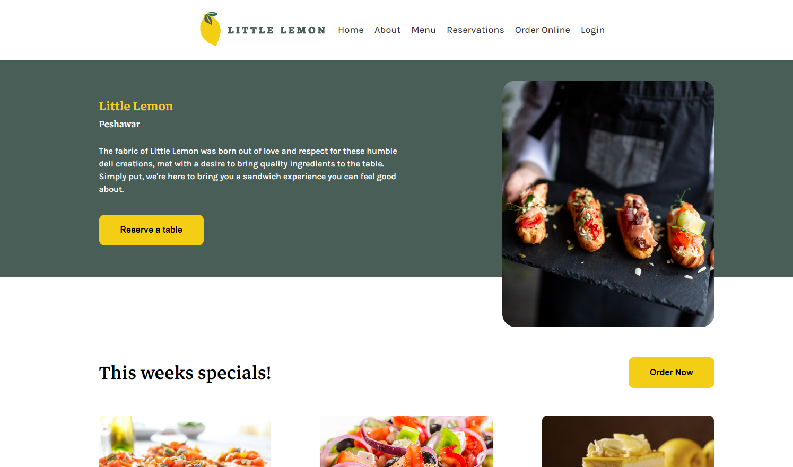

# Restaurant Website
This GitHub repository contains the code for a stunning restaurant website developed in React as part of the Meta Frontend Developer course. The project showcases a beautiful homepage, a reservation page with form validation, and other common features found in restaurant websites like menu display, customer reviews, and contact information. It utilizes modern frontend development techniques and libraries to deliver an interactive and visually appealing user experience. Feel free to explore the code.

## Live Demo
Check out the live demo of Restaurant Website 

## Features
- React-based
- Restaurant website
- Forms
- Form validation
- Routing
- Responsive design
- User-friendly interface
- Deployed to netlify
- Easy to use

## Technologies Used
- React.js
- HTML
- CSS
- Formik
- Yup

## Contributions
Contributions are always welcome! If you would like to contribute to restaurant, please fork the repository and submit a pull request.

## License
This project is licensed under the **Apache-2.0 license** - see the [LICENSE](LICENSE) file for details.